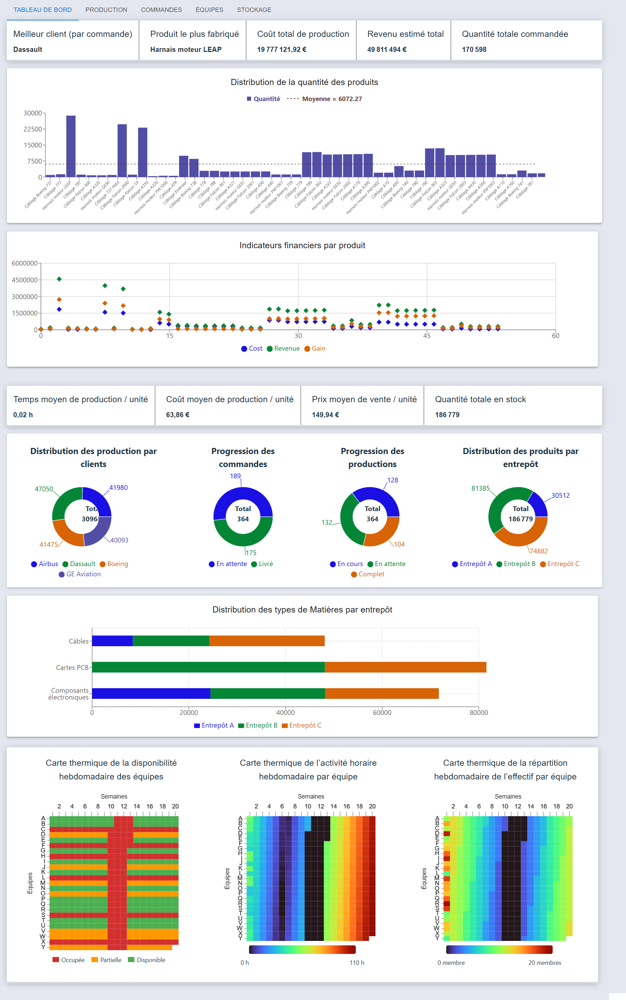
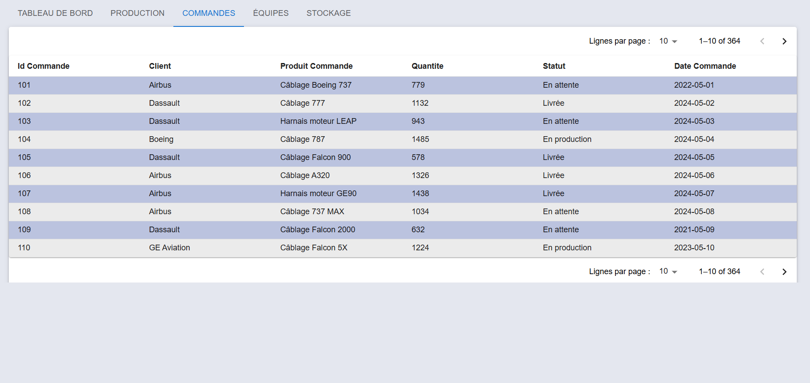
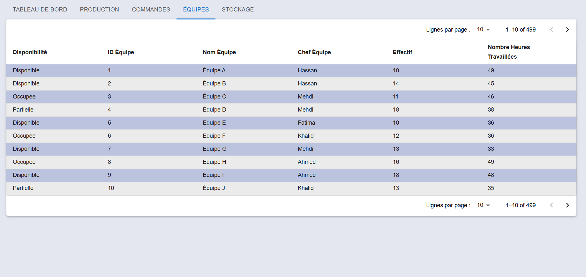
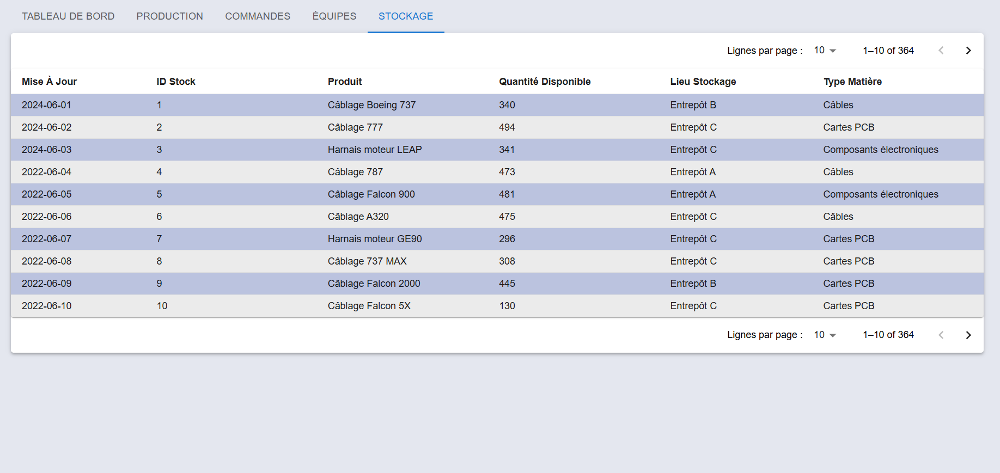
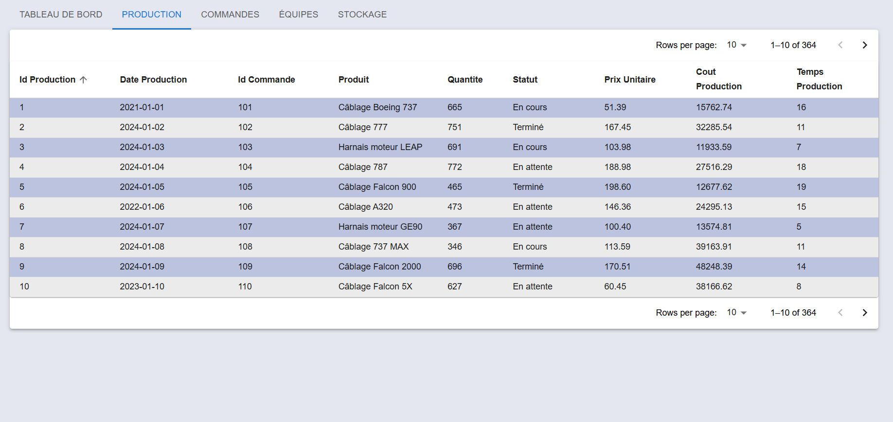

# Project Overview

Welcome to the Power BI and Backend Integration project. This project includes:

- A backend API to handle production and customer order data using FastAPI.
- A Power BI frontend (currently under construction) to visualize and analyze the data.


## Please refer to the README files for both the frontend and the backend

For detailed instructions, setup, and usage of the backend side of the application, please read the `README.md` files located under the `backend_BI` sub-directory and `frontend_bi` sub-directory respectively for the backend and the frontend side of the application. For each setup make sure that you navigate to designated directory.

# General Setup

1. Clone the repository:
    - HTTPS
    ```bash
    git clone https://github.com/zaddemraslen/PowerBI.git
    ```

    - SSH
    ```bash
    git clone git@github.com:zaddemraslen/PowerBI.git
    ```
    Use a password-protected SSH key.

    - GitHub CLI 
    ```bash
    gh repo clone zaddemraslen/PowerBI
    ```
    Requires GitHub CLI
2. Create a virtual environment:
    It is highly recommended to create a virtual environment to manage your project dependencies.

    - For macOS/Linux:
      ```bash
      python3 -m venv venv
      ```
    - For Windows:
      ```bash
      python -m venv venv
      ```

3. Activate the virtual environment:
    - For macOS/Linux:
      ```bash
      source venv/bin/activate
      ```
    - For Windows:
      ```bash
      .\venv\Scripts\activate
      ```
4. Follow the steps in the corresponding README.md files for both the backend and the front side of the application

# BI Dashboard Frontend

This is the **Business Intelligence (BI) dashboard** for our manufacturing data. It presents key metrics, interactive charts, and detailed tables for **Productions**, **Commandes** (Orders), **Équipes** (Teams) and **Stockage** (Stock) in a unified, tabbed interface.

---






## Purpose & Highlights

- **Executive KPI tiles**  
  - Best client by order  
  - Top manufactured product  
  - Total production cost  
  - Estimated total revenue  
  - Total quantity ordered  

- **Distribution & Trends**  
  - Quantity distribution bar chart with average line  
  - Scatter plot of cost, revenue, and gain per product  

- **Average Metrics**  
  - Production time per unit  
  - Production cost per unit  
  - Sale price per unit  
  - Total units in stock  

- **Progress Donuts**  
  - Production breakdown by client  
  - Order progression (pending vs. delivered)  
  - Production progression (in-progress, pending, complete)  
  - Stock distribution by warehouse  

- **Raw Material Bar Chart**  
  - Inventory of cables, PCBs, components per warehouse  

- **Weekly Heatmaps**  
  - Team availability (Occupied / Partial / Available)  
  - Team work-hours  
  - Team headcount  

- **Detailed Data Tables**  
  - **Production**: list of all production runs  
  - **Commandes**: list of all orders  
  - **Équipes** (coming soon)  
  - **Stockage** (coming soon)  

---

## Data Flow & Interactivity

1. **Custom Hooks** (`useFetchProductions`, etc.) call backend APIs and return `{ data, loading, error }`.
2. **Dashboard.tsx** aggregates all four datasets to render KPI tiles and charts via `HeatMapCharts`.
3. **Heatmap Data** is transformed by:
   - `buildTeamMap` → `teamMapToNivoData`  
   - `getMinMax` → `getRoundedRange` for dynamic color scales  
4. **Color Modes**:
   - Discrete colors for availability  
   - Continuous Turbo scale for work-hours and headcount  
5. **Synchronized Hover**:
   - Shared React state `hoveredCell` highlights the same `x,y` cell across all three heatmaps.

---

## BI-Focused Notes

- **KPI Tiles**: Executive snapshot of high-value metrics.  
- **Distribution & Trends**: Operational managers spot outliers and production bottlenecks.  
- **Donut Charts**: Quick status breakdowns for orders, production, and inventory.  
- **Heatmaps**: Capacity planning—visualize team availability, hours, and staffing over weeks.  
- **Data Tables**: Analysts drill down to individual records, sort, filter, and paginate.

---
